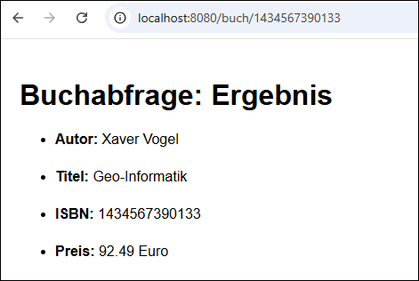

# Buchabfrage mit Load Balancing #

 

Diese Repository enthält zwei Maven-Projekte mit je einer Spring-Boot-Anwendung:

* [ISBN2Preis](ISBN2Preis/): REST-API zur Abfrage von Buchpreisen anhand der [ISBN13](https://de.wikipedia.org/wiki/Internationale_Standardbuchnummer#ISBN-13).

* [Buchabfrage](Buchabfrage/): Dieser Dienst implementiert client-seitiges Load Balancing,
  um eine der beiden Instanzen von `ISBN2Preis` abzufragen.

 

---

## Screenshot ##

 

 

---

## Services und Port-Nummern ##

 

| Service     | Instanz-Nr | Port-Nummer                   |
| ----------- | ---------- | ----------------------------- |
| Buchabfrage | nur eine   | [8080](http://localhost:8080) |
| ISBN2Preis  | 1          | [8010](http://localhost:8010) |
| ISBN2Preis  | 2          | [8020](http://localhost:8020) |
| ISBN2Preis  | 3          | [8020](http://localhost:8030) |

 

----

## License ##

 

See the [LICENSE file](LICENSE.md) for license rights and limitations (BSD 3-Clause License).

 
